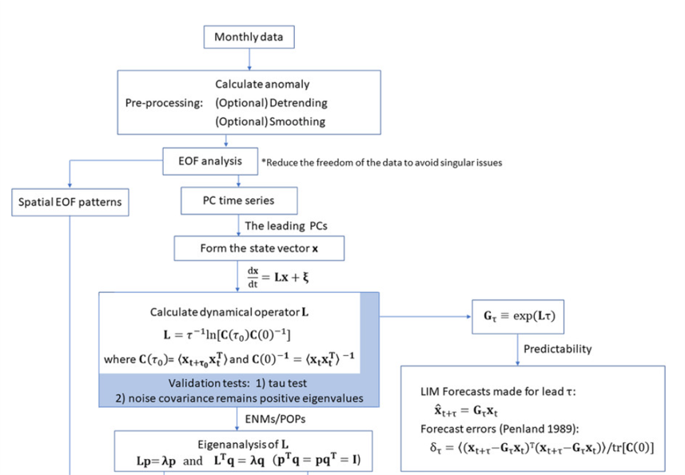

# Linear Inverse modeling
A LIM prototype.

LIM_utils: some useful functions about LIM. detailed descriptions are listed here.

LIM: main function to construt a LIM.

Nyquist_check: check for Nyquist mode. It refers to sampling question: if the sampled frequency is less than the minimal oscillation, some illusory mode will appear.

Q_test: ensure your LIM is accurately contrusted.

tau_test1: ensure the dynamical operator is insensitive to the selection of tau. by error variance.

tau_test2: test by norms of diff **L**.

tau_test3: draw **L**.

tau test4: test by traces between obs and LIM.

error test: ensure LIM's forecst are good and error growth is identical to the theoretical growth.

optimal_state: related to forecasts of opportunity.

forecast: use your LIM to forecast, a deterministic forecast.

long_run: use LIM to run a climatogical experiment. Aims at climatology research. Also, this can be called noise integration, a problistic forecast or ensemble forecast.

